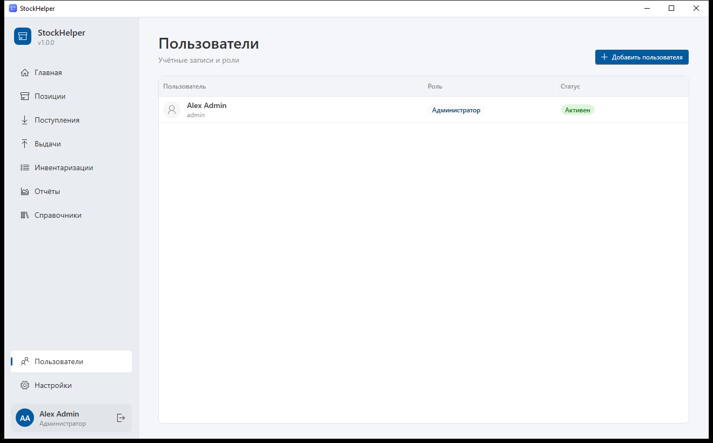

# Руководство администратора

Администратор устанавливает программу, создаёт учётные записи, места хранения, следит за резервными копиями и настройками. У администратора есть **все** права: он может делать то же, что кладовщик и руководитель.

Перед чтением пролистайте [общее руководство](general.md). Работа с позициями и отчётами описана в [руководстве руководителя](manager.md), а с поступлениями, выдачами и инвентаризациями — в [руководстве кладовщика](storekeeper.md).

## Содержание

- [Первый запуск](#первый-запуск)
- [Настройка с нуля: пошаговый план](#настройка-с-нуля-пошаговый-план)
- [Пользователи и роли](#пользователи-и-роли)
- [Места хранения](#места-хранения)
- [Параметры прогноза и закупок](#параметры-прогноза-и-закупок)
- [Резервные копии](#резервные-копии)
- [Обновления программы](#обновления-программы)
- [Где хранятся данные](#где-хранятся-данные)
- [Перенос на другой компьютер](#перенос-на-другой-компьютер)
- [Журналы и диагностика](#журналы-и-диагностика)
- [Типичные ситуации](#типичные-ситуации)

## Первый запуск

1. Скачайте **StockHelper-win-Setup.exe** со страницы <https://github.com/KeFFiA/StockHelper/releases/latest> и запустите. Установка проходит автоматически.
2. При первом запуске появится экран **«Добро пожаловать»** с предложением создать учётную запись администратора.
3. Заполните:
   - **Логин** — короткое имя для входа латиницей, например `admin` или `ivanov`;
   - **Имя** — как вас показывать в программе, например «Алексей Иванов»;
   - **Пароль** и **Повторите пароль** — не короче 4 символов.
4. Нажмите **Создать и войти**.

Программа сама заполнит справочники стандартными значениями:
- единицы измерения: шт, уп, пачка, л, кг, м, пара, рулон, комплект;
- категории: Канцелярия, Расходники для принтеров, Хозяйственные товары;
- место хранения: Основной склад.

Их можно переименовать, дополнить или перенести в архив.

> Запомните пароль администратора. Если в программе один администратор и он забыл пароль, восстановить доступ средствами программы нельзя. Поэтому рекомендуется завести **двух** администраторов.

## Настройка с нуля: пошаговый план

1. **Места хранения** — создайте все места, где лежат расходники (Справочники → Места хранения).
2. **Категории и единицы** — проверьте стандартные, добавьте свои и упаковки («Банка 5 л», «Коробка 5 пачек»). См. [руководство руководителя](manager.md#категории-и-единицы-измерения).
3. **Позиции** — внесите все расходные материалы с минимальными остатками и ценами (Позиции → Добавить позицию). Длинный список удобнее вносить вдвоём: руководитель и администратор могут работать одновременно.
4. **Пользователи** — создайте учётные записи для кладовщиков и руководителей.
5. **Первая инвентаризация** — кладовщик пересчитывает всё, что есть на складе. Это начальные остатки.
6. С этого момента кладовщик вносит **поступления** и **выдачи**, а раз в месяц проводит **инвентаризацию**.
7. Через месяц, после второй инвентаризации, заработают все отчёты и прогнозы.

## Пользователи и роли



Раздел **Пользователи** находится внизу меню и виден только администраторам.

### Роли

| Роль | Для кого | Что может |
|---|---|---|
| **Кладовщик** | Сотрудник склада | Поступления, выдачи, возвраты, инвентаризации, просмотр отчётов |
| **Руководитель** | Начальник, снабженец, бухгалтер | Справочник позиций, категорий и единиц, все отчёты со стоимостью, переоткрытие инвентаризаций |
| **Администратор** | Ответственный за программу | Всё, а также пользователи, места хранения, настройки и резервные копии |

Полная таблица прав — в [оглавлении документации](README.md#кто-что-может-делать).

### Как добавить пользователя

1. Нажмите **Добавить пользователя** (Ctrl+N).
2. Заполните:
   - **Логин** — уникальное имя для входа;
   - **Имя** — как показывать сотрудника в программе;
   - **Роль**;
   - **Пароль** и **Повторите пароль** — временный пароль (не короче 4 символов).
3. Нажмите **Сохранить**.
4. Сообщите сотруднику логин и пароль и попросите сменить пароль при первом входе (Настройки → Учётная запись → Сменить пароль).

### Изменение, сброс пароля, отключение

Щёлкните по строке пользователя:

- **Имя** и **роль** можно изменить; новая роль начнёт действовать при следующем входе сотрудника.
- **Новый пароль** — если сотрудник забыл пароль, введите новый дважды. Если поле оставить пустым, пароль не изменится.
- Флажок **«Учётная запись активна»** — снимите его, когда сотрудник увольняется или больше не должен работать с программой. Отключённый пользователь не сможет войти, но вся его история (кто что оформлял) сохранится. Удалять пользователей не нужно.

Ограничения, которые защищают от потери доступа:
- нельзя отключить самого себя или снять с себя роль администратора;
- в программе всегда должен оставаться хотя бы один активный администратор.

## Места хранения

Справочники → вкладка **Места хранения**. Создавать и изменять места может только администратор.

Место хранения — это любое место, где лежат расходники: «Основной склад», «Полка у принтера, 2 этаж», «Шкаф в бухгалтерии», «Подсобка». Для каждого указывается **название** и при желании **описание** (где именно находится).

Как места используются:
- при **поступлении** и **выдаче** можно указать, куда положили или откуда взяли товар;
- при **инвентаризации** кладовщик считает товар по каждому месту отдельно, а программа складывает;
- **остаток позиции — всегда сумма по всем местам**. Программа не ведёт отдельные остатки по местам и не требует оформлять перемещения между ними.

Неиспользуемое место можно удалить, а место с историей — перенести в архив.

## Параметры прогноза и закупок

Настройки → **Прогноз и закупки**. Изменять параметры может только администратор; остальные пользователи видят их без возможности редактирования.

| Параметр | По умолчанию | Что значит |
|---|---|---|
| **Горизонт закупки, дней** | 14 | Позиция попадёт в список на закупку, если её хватит меньше чем на это число дней. Ставьте срок, за который вы обычно успеваете заказать и получить товар. Допустимо 1–365. |
| **Период для среднего расхода, дней** | 90 | За какой период брать данные для расчёта среднего расхода в день. Меньше — прогноз быстрее реагирует на изменения, больше — устойчивее к случайным всплескам. Допустимо 7–3650. |
| **Хранить резервных копий** | 10 | Сколько последних резервных копий хранить; более старые удаляются автоматически. Допустимо 1–500. |

После изменения нажмите **Сохранить**. Отчёты пересчитаются при следующем открытии.

## Резервные копии

Настройки → **Резервные копии**. Раздел виден только администратору.

### Когда создаются копии

- **Автоматически** — перед каждым обновлением программы, которое меняет структуру базы данных, и перед восстановлением из копии.
- **Вручную** — кнопка **Создать резервную копию**. Делайте копию перед важными изменениями: массовой правкой справочника, переоткрытием старых инвентаризаций и т. п.

Рекомендуется раз в неделю создавать копию вручную и копировать её на флешку или в сетевую папку: копии в папке программы не спасут при поломке диска.

### Список копий

В списке видно дату создания и размер каждой копии. Кнопка **Открыть папку** открывает папку с копиями в Проводнике.

### Как восстановить данные из копии

1. Выберите копию в списке и нажмите **Восстановить** — или нажмите **Восстановить из файла…** и выберите файл копии (`.db`), например с флешки.
2. Прочитайте предупреждение: текущие данные будут **заменены** данными из копии; всё, что вносилось после её создания, пропадёт.
3. Подтвердите. Перед восстановлением программа автоматически сохранит копию текущего состояния — если вы ошиблись с выбором, можно вернуться обратно.
4. Программа перезапустится с восстановленными данными.

## Обновления программы

Программа обновляется сама:

1. При каждом запуске она проверяет, вышла ли новая версия (нужен интернет).
2. Новая версия скачивается в фоне, не мешая работе.
3. Появляется предложение **Перезапустить сейчас**. Если отказаться, обновление установится при следующем запуске.
4. Перед изменением структуры базы автоматически создаётся резервная копия.
5. После обновления каждый пользователь один раз увидит окно **«Что нового»** со списком изменений. Посмотреть его снова — Настройки → О программе → **Список изменений**.

Проверить обновления вручную — Настройки → О программе → **Проверить обновления**. Если появилось «Не удалось проверить обновления», проверьте доступ в интернет и к сайту github.com.

Каждая версия публикуется на странице <https://github.com/KeFFiA/StockHelper/releases> с описанием изменений.

## Где хранятся данные

Все данные хранятся отдельно от программы, в папке пользователя Windows:

```
%APPDATA%\StockHelper\
  stockhelper.db   база данных (всё: позиции, поступления, выдачи, инвентаризации, пользователи)
  backups\         резервные копии
  logs\            журналы работы программы
  settings.json    настройки (тема, параметры прогноза, размер окна)
```

Путь к папке виден в Настройки → О программе → **Папка с данными**; кнопка **Открыть папку** откроет её в Проводнике.

> Программа хранит базу на одном компьютере. Все пользователи работают с ней, входя под своими учётными записями на этом компьютере.

## Перенос на другой компьютер

1. На старом компьютере: Настройки → Резервные копии → **Создать резервную копию** → **Открыть папку**, скопируйте свежий файл копии на флешку.
2. На новом компьютере установите программу и создайте временного администратора на экране «Добро пожаловать».
3. Настройки → Резервные копии → **Восстановить из файла…** → выберите файл с флешки.
4. После перезапуска войдите под своей прежней учётной записью: все пользователи и данные перенесены.

## Журналы и диагностика

Если программа ведёт себя странно или появляется окно «Что-то пошло не так», подробности записываются в журналы: Настройки → О программе → **Журналы**. Каждый день — отдельный файл. При обращении к разработчику приложите файл журнала за нужный день.

## Типичные ситуации

**Сотрудник забыл пароль.**
Пользователи → щелчок по сотруднику → введите новый пароль дважды → Сохранить. Попросите сотрудника сменить его при входе.

**Сотрудник уволился.**
Пользователи → щелчок по сотруднику → снимите флажок «Учётная запись активна» → Сохранить.

**Нужно исправить завершённую инвентаризацию.**
Инвентаризации → щелчок по ней → **Переоткрыть** → исправьте → **Завершить**.

**Случайно удалили важные данные.**
Настройки → Резервные копии → выберите копию, созданную до ошибки → **Восстановить**. Учтите: всё, что внесено после этой копии, придётся внести заново.

**Программа не запускается после сбоя компьютера.**
Переустановите программу (данные не удалятся). Если база повреждена, восстановите её из последней резервной копии: скопируйте файл из `%APPDATA%\StockHelper\backups` на флешку, временно переименуйте папку `%APPDATA%\StockHelper`, запустите программу, создайте временного администратора и восстановите копию через **Восстановить из файла…**.
