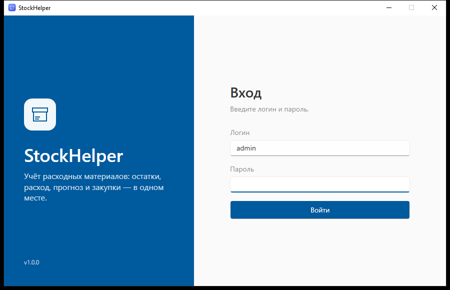
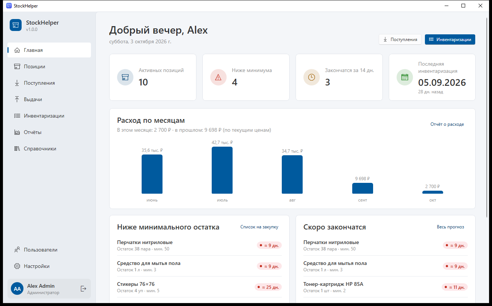
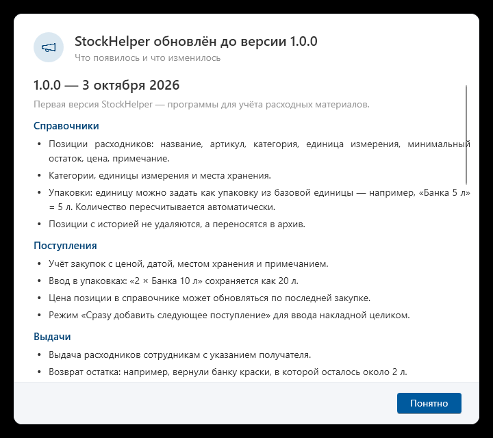

# Общее руководство

Это руководство для всех пользователей StockHelper. Оно объясняет, как установить и запустить программу, как устроено окно и как пользоваться таблицами, поиском и экспортом. Отдельные руководства для [кладовщика](storekeeper.md), [руководителя](manager.md) и [администратора](administrator.md) описывают работу по ролям.

## Содержание

- [Что умеет программа](#что-умеет-программа)
- [Установка](#установка)
- [Вход в программу](#вход-в-программу)
- [Как устроено окно](#как-устроено-окно)
- [Основные понятия](#основные-понятия)
- [Работа с таблицами](#работа-с-таблицами)
- [Поиск, фильтры и периоды](#поиск-фильтры-и-периоды)
- [Создание и редактирование записей](#создание-и-редактирование-записей)
- [Ввод количества в упаковках](#ввод-количества-в-упаковках)
- [Экспорт в Excel](#экспорт-в-excel)
- [Главная страница](#главная-страница)
- [Настройки для всех](#настройки-для-всех)
- [Обновления и список изменений](#обновления-и-список-изменений)
- [Горячие клавиши](#горячие-клавиши)
- [Частые вопросы](#частые-вопросы)

## Что умеет программа

- Хранит **справочник расходных материалов** (в программе они называются «позиции»): название, артикул, категория, единица измерения, минимальный остаток и цена.
- Учитывает **поступления** — всё, что закупили и привезли на склад.
- Учитывает **выдачи** — что, кому и когда выдали, а также **возвраты** остатков (например, начатую банку краски).
- Проводит **инвентаризации** — пересчёт того, что реально лежит на складе.
- **Сама считает остаток, расход и прогноз**: сколько осталось, сколько тратится в день и на сколько дней хватит.
- Составляет **список на закупку** и показывает **отчёты и графики**.
- Выгружает любые таблицы и отчёты **в Excel**.
- Работает с **ролями пользователей**: кладовщик, руководитель, администратор.
- Сама делает **резервные копии** базы и сама **обновляется**.

## Установка

1. Скачайте файл **StockHelper-win-Setup.exe** со страницы релизов: <https://github.com/KeFFiA/StockHelper/releases/latest>.
2. Запустите его. Установка проходит без вопросов и занимает несколько секунд; права администратора Windows не нужны.
3. После установки программа запустится сама, а на рабочем столе и в меню «Пуск» появится ярлык **StockHelper**.

Программа работает на Windows 10 и Windows 11. Дополнительно ничего устанавливать не нужно.

> Все данные программы хранятся в папке `%APPDATA%\StockHelper` (обычно `C:\Users\<имя>\AppData\Roaming\StockHelper`). Переустановка или обновление программы данные **не** удаляет.

## Вход в программу

1. Введите **логин** и **пароль**, которые вам выдал администратор.
2. Нажмите **Войти** или клавишу **Enter**.

Программа запоминает последний введённый логин, поэтому в следующий раз обычно достаточно ввести только пароль.

Если появилось сообщение:
- **«Неверный логин или пароль»** — проверьте раскладку клавиатуры (RU/EN) и не включён ли Caps Lock. Пароль чувствителен к регистру букв.
- **«Учётная запись отключена»** — ваш доступ отключил администратор. Обратитесь к нему.

Если вы забыли пароль, попросите администратора задать новый — восстановить старый пароль невозможно.

При самом первом запуске на новом компьютере программа попросит создать учётную запись администратора — подробнее в [руководстве администратора](administrator.md#первый-запуск).

## Как устроено окно

**Слева — меню разделов:**

| Раздел | Что там |
|---|---|
| **Главная** | Сводка: сколько позиций, что ниже минимума, что скоро закончится, когда была инвентаризация |
| **Позиции** | Справочник расходных материалов с остатками и прогнозом |
| **Поступления** | Всё, что пришло на склад |
| **Выдачи** | Всё, что выдали сотрудникам, возвраты и открытые упаковки |
| **Инвентаризации** | Пересчёты фактических остатков |
| **Отчёты** | Остатки и прогноз, список на закупку, расход, история, графики |
| **Справочники** | Категории, единицы измерения, места хранения |
| **Пользователи** | Учётные записи (только для администратора) |
| **Настройки** | Тема, пароль, информация о программе |

**Внизу меню** — ваше имя и роль. Кнопка со стрелкой справа от имени — **Выйти** (смена пользователя).

**Свернуть меню.** Нажмите на логотип **StockHelper** в левом верхнем углу (или **Ctrl+B**) — меню сожмётся до значков, и для таблиц останется больше места. Повторное нажатие разворачивает меню обратно. Программа запоминает этот выбор.

**Размер окна.** Программа запоминает размер и положение окна, а также то, было ли оно развёрнуто на весь экран, и при следующем запуске откроется так же.

**Подсказки.** Наведите курсор на кнопку, значок или заголовок столбца и подождите секунду — появится подсказка, что это и зачем.

**Уведомления.** После сохранения, удаления и других действий в правом нижнем углу на несколько секунд появляется короткое сообщение, например «Сохранено».

## Основные понятия

Чтобы правильно читать цифры в программе, важно понимать несколько терминов.

**Позиция** — один вид расходного материала: «Бумага А4», «Краска белая», «Перчатки нитриловые». У каждой позиции есть своя единица измерения (шт, л, пачка, пара…).

**Место хранения** — где физически лежит товар: «Основной склад», «Полка у принтера», «Шкаф в бухгалтерии». Одна позиция может лежать в нескольких местах сразу. Программе важен **общий остаток** по позиции — сумма по всем местам.

**Остаток** — сколько товара сейчас есть. Программа считает его так:

> Остаток = результат последней инвентаризации + поступления после неё − выдачи после неё + возвраты после неё

Поэтому остаток — это **расчётная** цифра. Она точна, только если все поступления и выдачи вносятся в программу. Инвентаризация «сверяет часы»: фиксирует, что лежит на самом деле.

**Минимальный остаток** — сколько товара должно быть всегда. Если остаток стал меньше минимального, позиция попадает в список «Ниже минимума» и в список на закупку.

**Расход** — сколько товара потрачено за период. Если по позиции оформляются выдачи, расход = выдано − возвращено. Если выдачи по позиции не ведутся (например, бумага просто лежит у принтера), расход считается по инвентаризациям: «было − стало + пришло».

**Средний расход в день** — расход за последние 90 дней (период настраивает администратор), делённый на число дней.

**Прогноз** — на сколько дней хватит текущего остатка при среднем расходе. Показывается цветной меткой:

- 🟢 **зелёная** — запаса хватит надолго;
- 🔴 **красная** — товар скоро закончится или уже ниже минимума.

Прогноз появляется, когда у программы есть данные о расходе: после двух инвентаризаций или после первых выдач.

**Горизонт закупки** — на сколько дней вперёд вы закупаете (по умолчанию 14). Если товара хватит меньше чем на этот срок, он попадёт в список на закупку.

**Инвентаризация** — пересчёт товара на складе. Пока она в статусе **«Черновик»**, её можно заполнять; после **завершения** её результаты становятся новой точкой отсчёта для остатков.

**Архив.** Позиции, категории и другие записи, которые больше не нужны, но уже использовались, нельзя удалить — их **переносят в архив**. Архивные записи не мешают в списках, но вся их история сохраняется. Из архива запись можно вернуть.

## Работа с таблицами

Почти каждый раздел — это таблица.

- **Открыть запись** — **один щелчок** по строке. Справа откроется панель с подробностями.
- **Сортировка** — щелчок по заголовку столбца. Повторный щелчок меняет направление (по возрастанию / по убыванию).
- **Ширина столбцов** — потяните за границу заголовка.
- Над таблицей указано, сколько записей показано, например «Показано 10 из 10» или «Записей: 7 · на руках: 1».
- Кнопка **⟳ Обновить** (или **F5**) перечитывает данные — полезно, если с программой одновременно работают несколько человек.

Если таблица пустая, программа подскажет, почему, и что сделать дальше.

## Поиск, фильтры и периоды

- **Поиск** — поле со значком лупы над таблицей. Начните вводить часть названия, артикула, категории, получателя или примечания — таблица отфильтруется сразу. **Ctrl+F** переводит курсор в поле поиска, **Esc** очищает его.
- **Фильтр по категории** — выпадающий список «Все категории» в разделе «Позиции».
- **Показывать архивные** — флажок, который добавляет в таблицу записи из архива.
- **Период** — поля «с … по …» в поступлениях и выдачах. Рядом есть быстрые кнопки **7 дней**, **30 дней**, **90 дней**, **Всё время**.

## Создание и редактирование записей

1. Нажмите синюю кнопку в правом верхнем углу раздела («Добавить позицию», «Добавить поступление», «Выдать» и т. д.) или **Ctrl+N**.
2. Справа откроется панель редактирования. Заполните поля. Обязательные поля программа проверит сама и подсветит ошибку с пояснением.
3. Нажмите **Сохранить**.

Чтобы **изменить** запись, щёлкните по её строке, исправьте поля и нажмите **Сохранить**. Чтобы **закрыть** панель без сохранения — **Отмена** или **Esc**. Если вы что-то изменили и закрываете панель, программа спросит, сохранить ли изменения.

**Удаление и архив** — внизу панели редактирования. Перед удалением программа всегда спрашивает подтверждение. Если запись уже где-то использовалась, удалить её нельзя — вместо этого её можно перенести в архив.

**Даты и время** вводятся в формате ДД.ММ.ГГГГ и ЧЧ:ММ. Дату удобно выбирать в календаре (значок справа от поля).

**Дробные числа** вводятся с запятой: `12,5`.

## Ввод количества в упаковках

Товар часто приходит и выдаётся упаковками: банками, коробками, пачками. В программе можно настроить **упаковки** (например, «Банка 5 л» = 5 л), и тогда количество можно вводить прямо в упаковках:

- в поле количества введите число, например `2`;
- справа выберите упаковку «Банка 5 л»;
- под полем программа покажет пересчёт: **= 10 л**.

В учёт всегда записывается количество в основной единице позиции (литрах), а в таблице дополнительно видно, как его вводили: «10 л · 2 × Банка 5 л».

## Экспорт в Excel

В каждом разделе есть кнопка **Экспорт в Excel** (или **Ctrl+E**).

1. Нажмите кнопку.
2. Выберите, куда сохранить файл.
3. После сохранения появится уведомление с кнопкой **Открыть**.

Выгружается **то, что сейчас видно в таблице** — с учётом поиска, фильтров и периода. В разделе «Отчёты» программа спросит, что выгрузить: только открытый отчёт или **все отчёты одним файлом** (каждый на отдельном листе).

Если появилось сообщение «Не удалось сохранить файл», скорее всего, файл с таким именем открыт в Excel. Закройте его или сохраните под другим именем.

## Главная страница

Главная показывает самое важное на сегодня:

- **Активных позиций** — сколько позиций в справочнике (без архивных).
- **Ниже минимума** — сколько позиций нужно закупить.
- **Закончатся за N дн.** — сколько позиций закончится раньше, чем пройдёт горизонт закупки.
- **Последняя инвентаризация** — дата и сколько дней прошло. Рекомендуется проводить инвентаризацию не реже раза в месяц.
- Списки **«Ниже минимального остатка»** и **«Скоро закончатся»** с остатком и прогнозом по каждой позиции. Ссылки «Список на закупку» и «Весь прогноз» ведут в отчёты.
- Руководитель и администратор дополнительно видят график **«Расход по месяцам»** в рублях.

Кнопки вверху справа — быстрый переход к поступлениям и инвентаризациям.

Если в программе ещё нет ни одной инвентаризации, на главной появится подсказка: проведите первую инвентаризацию — она станет точкой отсчёта.

## Настройки для всех

Раздел **Настройки** (внизу меню):

- **Тема оформления** — «Как в системе», «Светлая» или «Тёмная». «Как в системе» автоматически следует теме Windows.
- **Учётная запись → Сменить пароль** — введите текущий пароль и дважды новый (не короче 4 символов).
- **Горячие клавиши** — шпаргалка по клавишам.
- **О программе** — номер версии, кнопки **Список изменений** и **Проверить обновления**, папка с данными.

## Обновления и список изменений

Программа сама проверяет обновления при каждом запуске (нужен интернет). Если вышла новая версия, она тихо скачается в фоне, и программа предложит **Перезапустить сейчас**. Можно отказаться — обновление установится при следующем запуске. Данные при обновлении сохраняются, а перед изменением структуры базы программа делает резервную копию.

После обновления при первом запуске один раз появится окно **«StockHelper обновлён до версии …»** со списком того, что появилось и изменилось.

Посмотреть список изменений ещё раз можно в любой момент: **Настройки → О программе → Список изменений**.

Проверить обновления вручную — **Настройки → О программе → Проверить обновления**.

## Горячие клавиши

| Клавиши | Действие |
|---|---|
| **Ctrl+N** | Создать запись на текущей странице |
| **Ctrl+F** | Перейти к поиску |
| **Ctrl+E** | Экспорт таблицы в Excel |
| **F5** | Обновить данные |
| **Ctrl+1 … Ctrl+9** | Перейти к разделу меню по номеру (1 — Главная, 2 — Позиции и т. д.) |
| **Ctrl+B** | Свернуть или развернуть меню |
| **Esc** | Очистить поиск, закрыть панель редактирования |
| **Enter / ↑ / ↓** | В инвентаризации: сохранить и перейти к следующей / предыдущей строке |

## Частые вопросы

**Остаток в программе не совпадает с тем, что лежит на складе. Почему?**
Остаток расчётный. Если какую-то выдачу или поступление забыли внести, цифра разойдётся с реальностью. Проведите инвентаризацию — она зафиксирует фактический остаток, а расхождение будет видно в отчёте «История».

**Почему у позиции нет прогноза («нет данных»)?**
Программе пока не из чего посчитать расход: нужно две завершённые инвентаризации или выдачи по этой позиции.

**Я случайно удалил запись. Можно вернуть?**
Удаление необратимо, но администратор может восстановить базу из резервной копии (при этом пропадут изменения, сделанные после создания копии).

**Появилось сообщение «Запись была изменена другим пользователем».**
Кто-то другой изменил ту же запись, пока вы её редактировали. Нажмите **F5**, чтобы обновить данные, и внесите изменения ещё раз.

**Появилось окно «Что-то пошло не так».**
Действие не выполнилось, но данные не потеряны. Попробуйте ещё раз. Если ошибка повторяется, сообщите администратору: подробности записываются в журнал (Настройки → Журналы).
