# Руководство руководителя

Руководитель отвечает за справочник расходных материалов и за то, чтобы их всегда хватало. Он не вносит ежедневные операции (это делает кладовщик), но видит всю картину: остатки, расход в штуках и рублях, недостачи, прогнозы и список на закупку.

Перед чтением пролистайте [общее руководство](general.md): там описано, как устроено окно, что такое остаток, расход и прогноз, как работают таблицы и экспорт.

## Содержание

- [Что доступно руководителю](#что-доступно-руководителю)
- [Главная: контроль за минуту](#главная-контроль-за-минуту)
- [Справочник позиций](#справочник-позиций)
- [Категории и единицы измерения](#категории-и-единицы-измерения)
- [Отчёты](#отчёты)
  - [Остатки и прогноз](#остатки-и-прогноз)
  - [Список на закупку](#список-на-закупку)
  - [Расход за период](#расход-за-период)
  - [История](#история)
  - [Графики](#графики)
- [Переоткрытие инвентаризации](#переоткрытие-инвентаризации)
- [Как добиться точных цифр](#как-добиться-точных-цифр)
- [Типичные задачи](#типичные-задачи)

## Что доступно руководителю

| Можно | Нельзя |
|---|---|
| Добавлять, изменять, архивировать позиции | Оформлять поступления и выдачи |
| Вести категории и единицы измерения (включая упаковки) | Вводить данные инвентаризации |
| Смотреть все отчёты, включая стоимость расхода | Создавать места хранения |
| Видеть графики расхода в рублях на главной | Управлять пользователями |
| Переоткрывать завершённые инвентаризации | Менять параметры прогноза и резервные копии |

Поступления, выдачи и инвентаризации руководитель видит полностью, но только для просмотра.

## Главная: контроль за минуту

Откройте программу — и на главной сразу видно:

- **Ниже минимума** — сколько позиций нужно закупать уже сейчас.
- **Закончатся за 14 дн.** — сколько позиций закончится раньше, чем вы успеете их закупить (14 — горизонт закупки, его меняет администратор).
- **Последняя инвентаризация** — давно ли сверяли склад. Если прошло больше месяца, цифры могут «уплыть» — попросите кладовщика провести пересчёт.
- **Расход по месяцам** — столбики в рублях за последние месяцы. Над графиком — сравнение «в этом месяце / в прошлом». Наведите курсор на столбик, чтобы увидеть точную сумму. Ссылка **Отчёт о расходе** открывает подробный отчёт.
- **Ниже минимального остатка** и **Скоро закончатся** — конкретные позиции с остатком и прогнозом. Ссылки ведут в «Список на закупку» и «Весь прогноз».

> Стоимость считается **по текущим ценам** из справочника. Если цены давно не обновлялись, суммы будут неточными — следите, чтобы при поступлениях включался флажок «Обновить цену позиции в справочнике».

## Справочник позиций

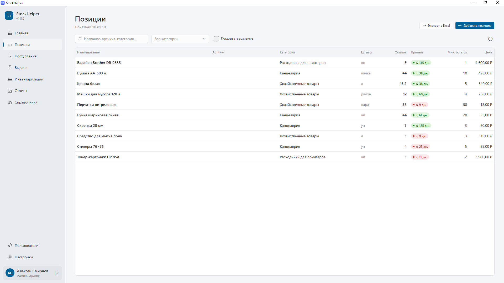

Раздел **Позиции** (Ctrl+2) — список всех расходных материалов. В таблице для каждой позиции: наименование, артикул, категория, единица, **остаток**, **прогноз**, минимальный остаток и цена.

### Как добавить позицию

1. Нажмите **Добавить позицию** (Ctrl+N).
2. Заполните поля:
   - **Наименование** — понятное всем название: «Бумага А4, 500 л.», «Перчатки нитриловые». Название должно быть уникальным.
   - **Артикул** — код поставщика или внутренний номер (необязательно).
   - **Категория** — группа для фильтров и отчётов.
   - **Ед. изм.** — в чём **считается** позиция. Выбирайте самую мелкую удобную единицу: краску — в литрах, бумагу — в пачках, перчатки — в парах. Упаковки (банки, коробки) настраиваются отдельно, см. [единицы измерения](#категории-и-единицы-измерения).
   - **Мин. остаток** — сколько должно быть всегда. Ниже этого количества позиция попадёт в список на закупку.
   - **Цена** — цена за одну единицу. Используется для оценки стоимости расхода и закупки.
   - **Примечание** — что угодно: поставщик, где заказывать, аналоги.
3. Нажмите **Сохранить**.

### Как выбрать минимальный остаток

Хорошее правило: минимальный остаток = расход за время доставки + небольшой запас. Если перчаток уходит ~4 пары в день, а поставка идёт неделю, минимум — около 30–40 пар. Средний расход в день по каждой позиции виден в отчёте «Остатки и прогноз».

### Карточка позиции

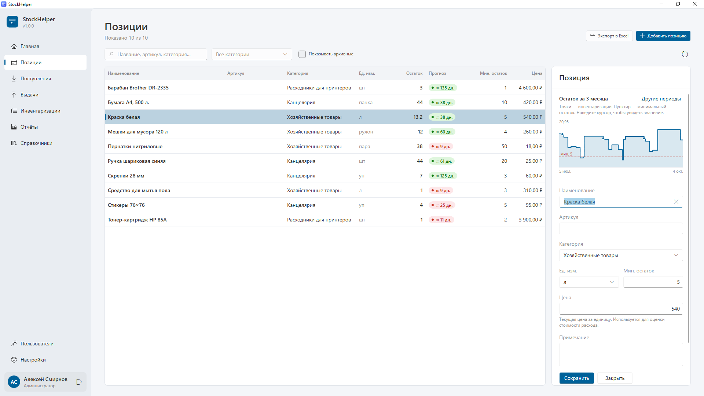

Щёлкните по строке — справа откроется карточка. Помимо полей, там есть график **«Остаток за 3 месяца»**:
- линия — как менялся остаток;
- точки — инвентаризации;
- пунктир — минимальный остаток.

Наведите курсор на график, чтобы увидеть точное значение на дату. Ссылка **Другие периоды** откроет графики в отчётах, где можно выбрать месяц, полгода или год.

### Архив и удаление

- **Удалить** можно только позицию, по которой ещё не было ни поступлений, ни выдач, ни инвентаризаций.
- Позицию с историей можно **перенести в архив**: она исчезнет из списков, инвентаризаций и закупок, но вся история и отчёты по ней сохранятся. Посмотреть архивные позиции — флажок **Показывать архивные**; вернуть — кнопка **Вернуть из архива** в карточке.

## Категории и единицы измерения

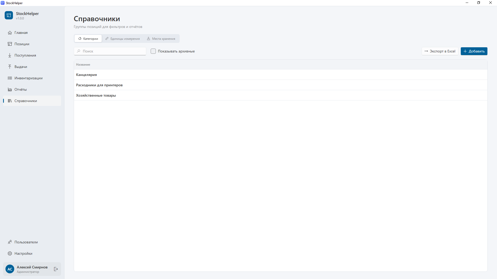

Раздел **Справочники** (Ctrl+7) состоит из трёх вкладок: **Категории**, **Единицы измерения**, **Места хранения**. Руководитель ведёт первые две; места хранения создаёт администратор.

### Категории

Категории группируют позиции: «Канцелярия», «Расходники для принтеров», «Хозяйственные товары». Они используются в фильтре раздела «Позиции» и в отчётах. Добавление — кнопка **Добавить**, переименование — щелчок по строке.

### Единицы измерения и упаковки

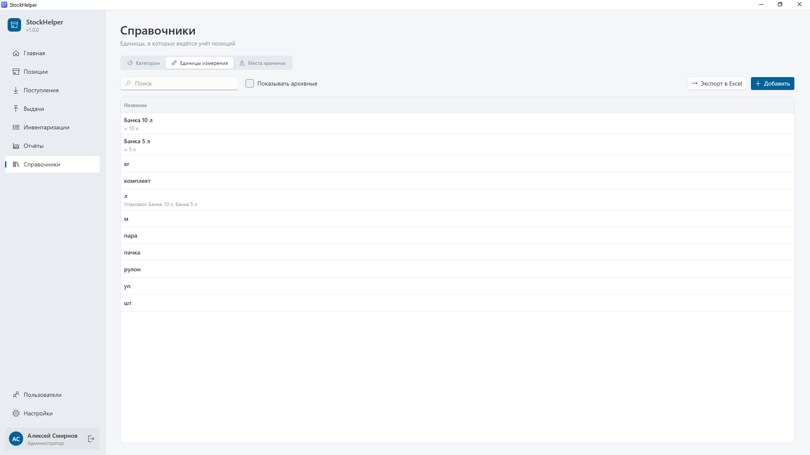

Есть два вида единиц:

- **Базовые единицы** — то, в чём ведётся учёт: шт, л, кг, м, пачка, пара, рулон.
- **Упаковки** — то, чем товар приходит и выдаётся: «Банка 5 л», «Коробка 5 пачек», «Упаковка 100 шт». Каждая упаковка состоит из базовой единицы.

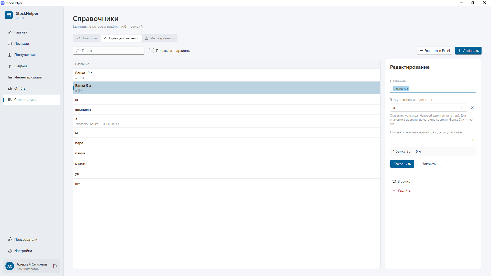

**Как создать упаковку:**

1. Вкладка **Единицы измерения** → **Добавить**.
2. **Название** — например, «Банка 5 л».
3. **Это упаковка из единицы** — выберите базовую единицу «л».
4. **Сколько базовых единиц в одной упаковке** — `5`.
5. Программа покажет проверку: «1 Банка 5 л = 5 л». Нажмите **Сохранить**.

Теперь кладовщики могут вводить поступления, выдачи и инвентаризации в банках, а программа сама пересчитает в литры.

Правила:
- упаковка может состоять только из базовой единицы (нельзя сделать «коробку из банок»);
- у базовой единицы, которая уже используется позициями, нельзя менять тип;
- в строке базовой единицы видно, какие упаковки из неё сделаны.

## Отчёты

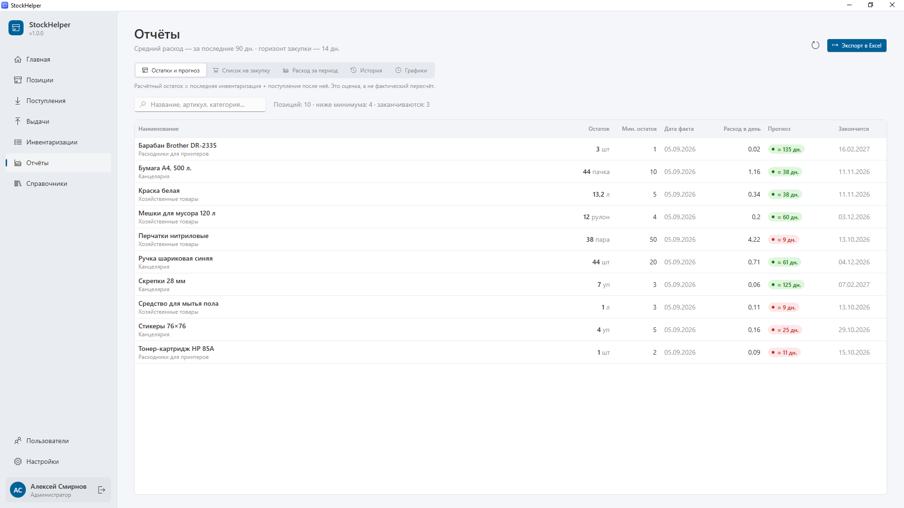

Раздел **Отчёты** (Ctrl+6) содержит пять вкладок. Под заголовком указано, за какой период считается средний расход (по умолчанию 90 дней) и какой горизонт закупки (14 дней). Под каждой вкладкой есть пояснение, как считаются цифры.

Кнопка **Экспорт в Excel** спросит, что выгрузить: текущий отчёт или **все отчёты одним файлом** — каждый на отдельном листе. Это удобно для отправки по почте или печати.

### Остатки и прогноз

Таблица по всем активным позициям:

| Столбец | Что значит |
|---|---|
| **Остаток** | Расчётный остаток сейчас |
| **Мин. остаток** | Минимум из справочника |
| **Дата факта** | Когда позицию последний раз пересчитывали. «без инвентаризации» — ни разу |
| **Расход в день** | Средний расход за период |
| **Прогноз** | На сколько дней хватит; красная метка — скоро закончится |
| **Закончится** | Ориентировочная дата, когда остаток станет нулевым |

Над таблицей — сводка: сколько позиций, сколько ниже минимума и сколько заканчиваются.

### Список на закупку

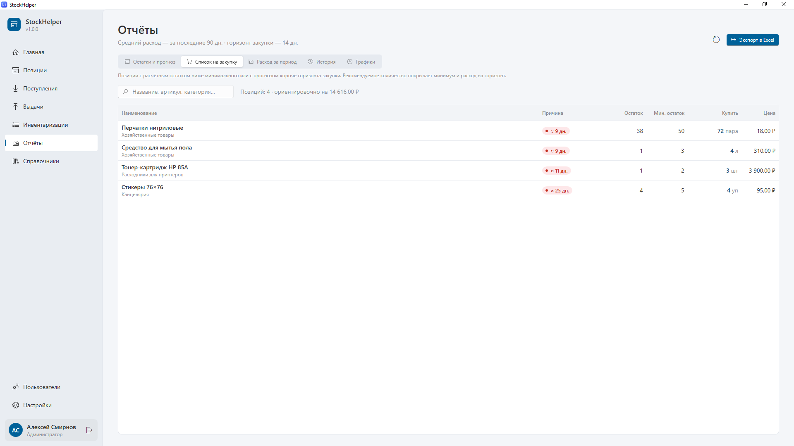

Сюда попадают позиции, у которых остаток ниже минимального **или** которых не хватит на горизонт закупки. Для каждой:

- **Купить** — рекомендуемое количество: чтобы покрыть минимальный остаток и расход на горизонт закупки;
- **Причина** — цветная метка прогноза: на сколько дней хватит текущего остатка (красная — меньше горизонта закупки или уже ниже минимума);
- цена и ориентировочная стоимость. Внизу сводки — общая сумма закупки.

Выгрузите список в Excel и отправьте снабженцу или поставщику. Если список пуст — «Закупать пока нечего».

### Расход за период

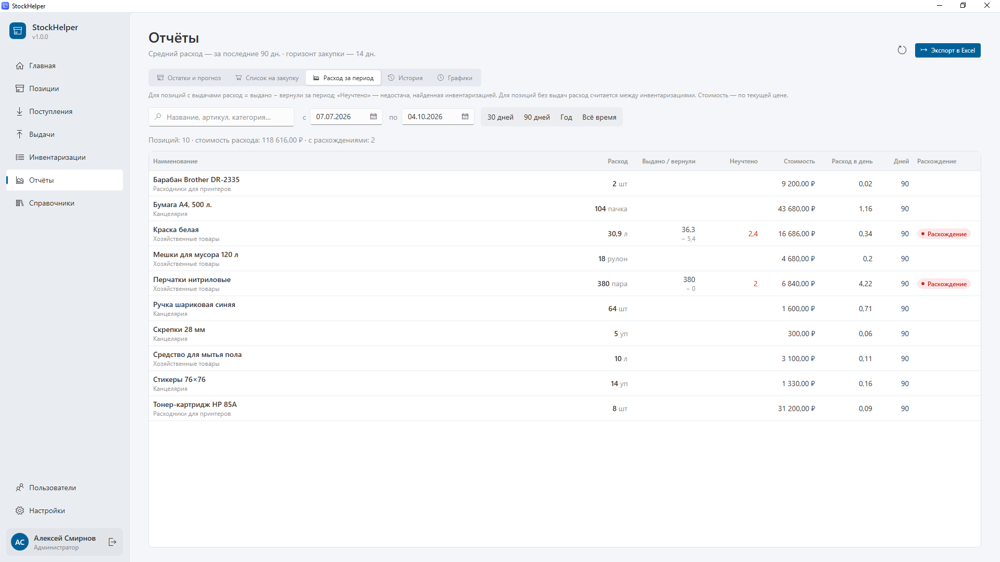

Сколько и чего потрачено за выбранный период (поля **с … по …** или кнопки **30 дней / 90 дней / Год / Всё время**).

| Столбец | Что значит |
|---|---|
| **Расход** | Сколько потрачено в единицах позиции |
| **Выдано / вернули** | Сколько выдали и сколько вернули остатком |
| **Неучтено** | Недостача по инвентаризации: пропало больше, чем оформлено выдачами |
| **Стоимость** | Расход в рублях по текущей цене |
| **Источник расхода** | «Выдачи» или «Инвентаризации» — откуда взят расход |

Как считается расход:
- если по позиции оформлялись выдачи, расход = выдано − вернули;
- если выдач не было, расход считается между инвентаризациями: было + пришло − стало.

Метка **Расхождение** означает отрицательный расход: при пересчёте оказалось больше, чем ожидалось. Обычно это забытое поступление или ошибка ввода — попросите кладовщика проверить.

**Столбец «Неучтено» — главный инструмент контроля.** Если по позиции регулярно появляется «неучтено», значит, товар уходит без оформления выдач. Обсудите это с кладовщиком.

### История

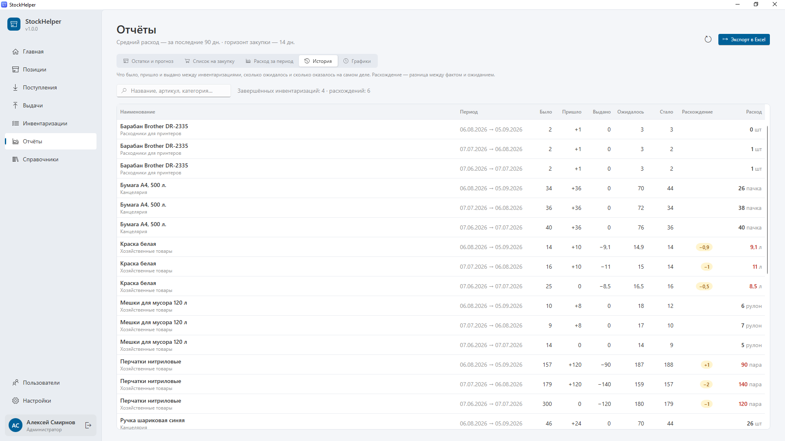

Что происходило между инвентаризациями по каждой позиции:

| Столбец | Что значит |
|---|---|
| **Период** | От какой до какой инвентаризации |
| **Было** | Факт на начало |
| **Пришло** | Поступления за период |
| **Выдано** | Выдачи за период (за вычетом возвратов) |
| **Ожидалось** | Было + пришло − выдано |
| **Стало** | Факт на конец |
| **Расхождение** | Стало − ожидалось: «−» — недостача, «+» — излишек |

История появляется после второй завершённой инвентаризации.

### Графики

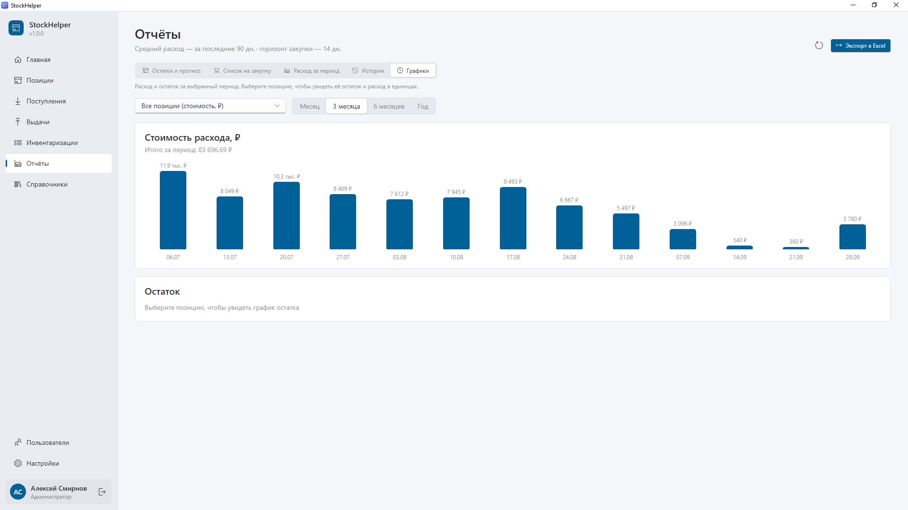

Выберите период — **Месяц**, **3 месяца**, **6 месяцев** или **Год**.

- **Все позиции (стоимость, ₽)** — столбики с суммой расхода по неделям или месяцам. Удобно смотреть, как меняются затраты.
- **Конкретная позиция** — выберите её в поле поиска: появится расход в единицах и график остатка с точками инвентаризаций и линией минимума.

Наведите курсор на столбик или линию, чтобы увидеть точное значение.

## Переоткрытие инвентаризации

Завершённую инвентаризацию нельзя изменить, чтобы никто случайно не испортил данные.

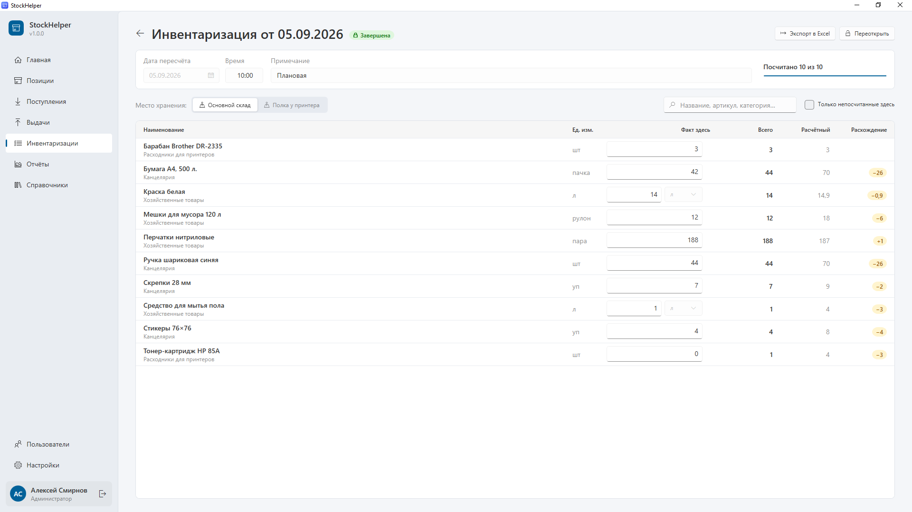 Если кладовщик ошибся:

1. Откройте **Инвентаризации** и щёлкните по нужной.
2. Нажмите **Переоткрыть** и подтвердите.
3. Инвентаризация вернётся в статус «Черновик»; пока она не завершена повторно, её данные **не участвуют в расчётах**.
4. Кладовщик (или администратор) исправляет значения и снова нажимает **Завершить**.

Не оставляйте переоткрытую инвентаризацию надолго: пока она в черновике, нельзя начать новую.

## Как добиться точных цифр

1. **Все выдачи — через программу.** Это главный источник данных о расходе.
2. **Поступления — в день прихода**, с ценой.
3. **Инвентаризация — раз в месяц.** Она исправляет накопившиеся ошибки и выявляет недостачи.
4. **Минимальные остатки и цены — актуальные.** Пересматривайте их раз в квартал.
5. **Упаковки настроены.** Тогда кладовщику не придётся пересчитывать банки в литры в уме.

## Типичные задачи

**Подготовить заявку на закупку.**
Отчёты → Список на закупку → Экспорт в Excel → «Текущий отчёт».

**Узнать, сколько потратили на расходники за квартал.**
Отчёты → Расход за период → задайте даты → сумма в сводке над таблицей. Или Отчёты → Графики → «3 месяца».

**Понять, почему закончилась краска раньше прогноза.**
Позиции → щелчок по краске → график остатка. Затем Выдачи → поиск «краска», чтобы увидеть, кому и сколько выдавали.

**Найти недостачи.**
Отчёты → Расход за период → столбец «Неучтено»; Отчёты → История → столбец «Расхождение».

**Перестали закупать товар.**
Перенесите позицию в архив — она пропадёт из списков, но история сохранится.
