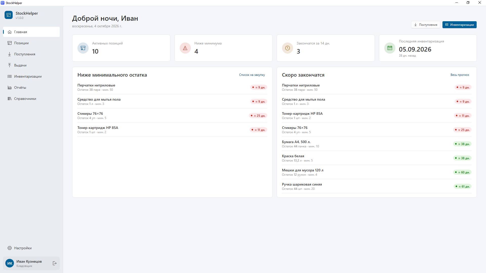
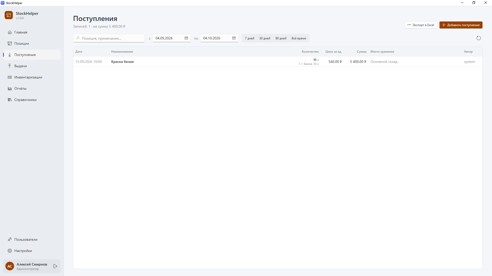
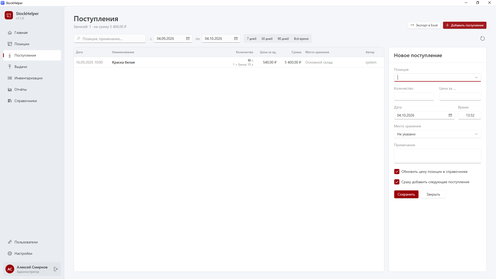
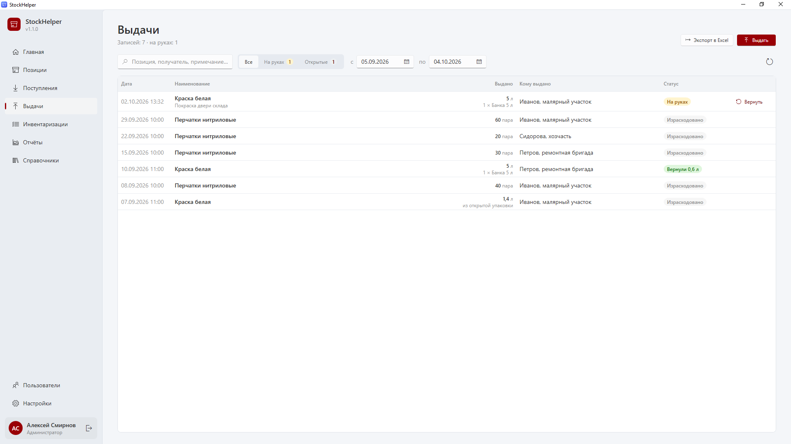
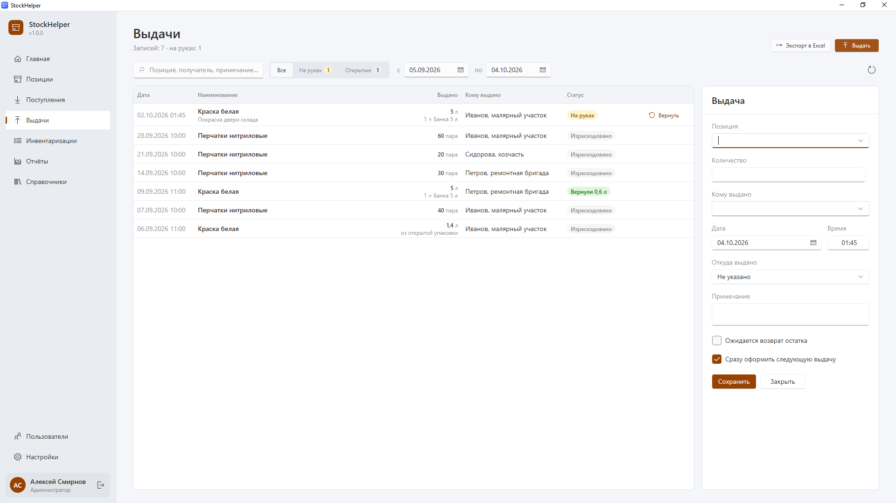
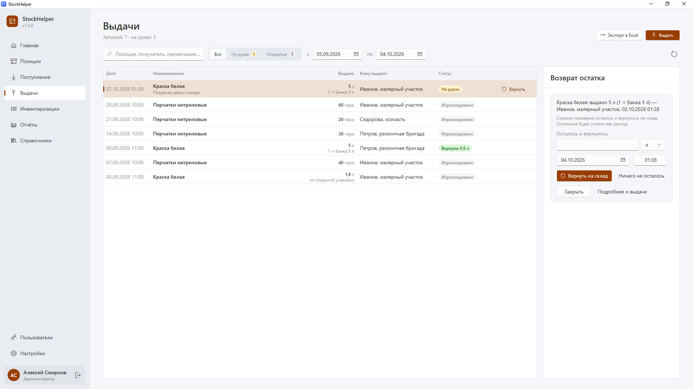
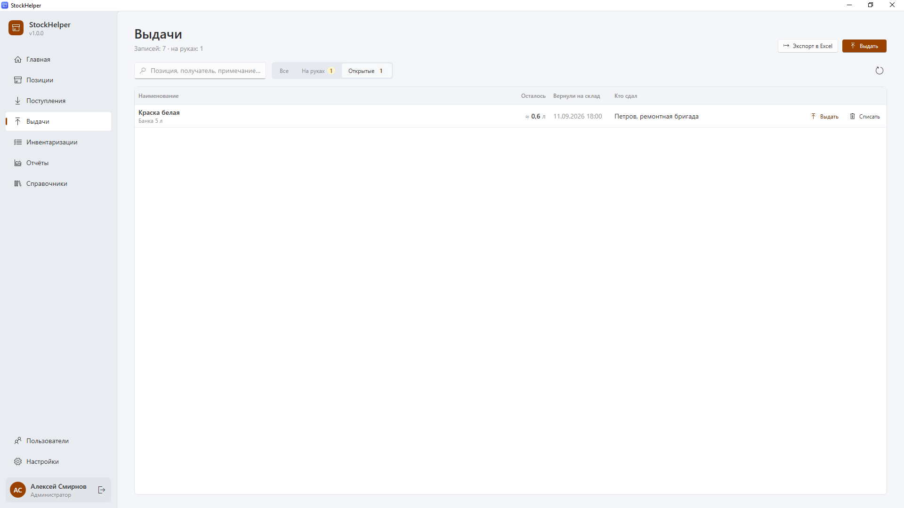
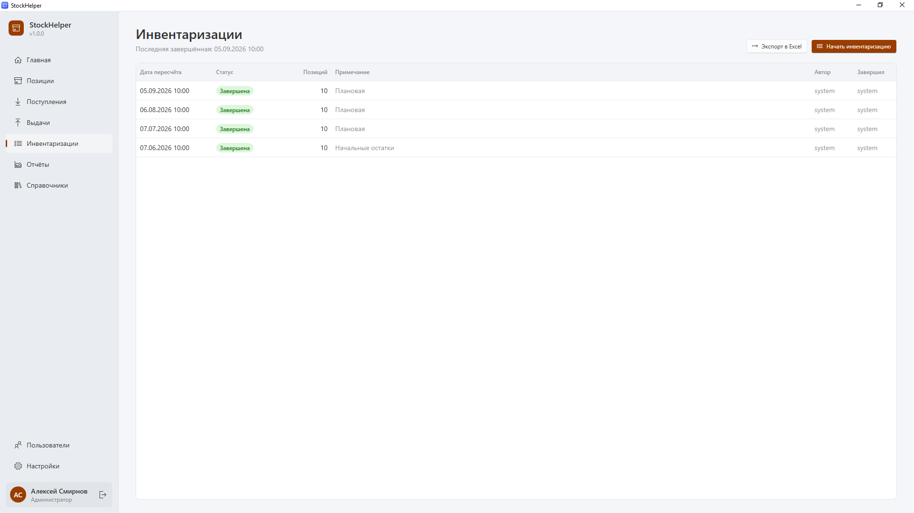
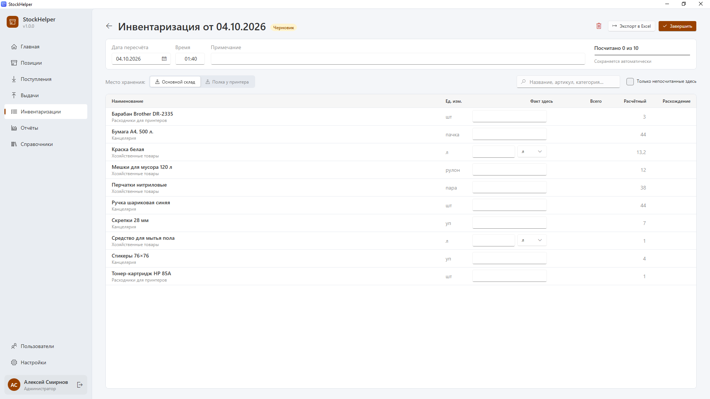

# Руководство кладовщика

Кладовщик ведёт ежедневный учёт: принимает товар, выдаёт его сотрудникам, принимает возвраты и проводит инвентаризации. От того, насколько аккуратно вносятся эти операции, зависит точность остатков, прогнозов и списка на закупку.

Перед чтением этого руководства пролистайте [общее руководство](general.md): там описано, как устроено окно, как работают таблицы, поиск и ввод в упаковках.

## Содержание

- [Что доступно кладовщику](#что-доступно-кладовщику)
- [Распорядок работы](#распорядок-работы)
- [Поступления: приём товара](#поступления-приём-товара)
- [Выдачи: выдача товара сотрудникам](#выдачи-выдача-товара-сотрудникам)
- [Возвраты остатков](#возвраты-остатков)
- [Открытые упаковки](#открытые-упаковки)
- [Инвентаризация](#инвентаризация)
- [Позиции и отчёты](#позиции-и-отчёты)
- [Типичные ситуации](#типичные-ситуации)

## Что доступно кладовщику

| Можно | Нельзя |
|---|---|
| Оформлять, исправлять и удалять поступления | Добавлять и изменять позиции в справочнике |
| Оформлять выдачи и возвраты | Создавать категории, единицы, места хранения |
| Списывать остатки открытых упаковок | Переоткрывать завершённые инвентаризации |
| Начинать, заполнять и завершать инвентаризации | Видеть графики стоимости |
| Смотреть позиции, отчёты и графики расхода в единицах | Управлять пользователями и настройками |

Если на складе появился новый товар, которого нет в справочнике, попросите руководителя или администратора добавить позицию.

## Распорядок работы

**Каждый день:**
- Привезли товар — оформите **поступление**.
- Сотрудник забрал расходник — оформите **выдачу**.
- Принесли обратно начатую упаковку — оформите **возврат**.

**Раз в месяц** (или чаще, если так принято на предприятии):
- Проведите **инвентаризацию** — пересчитайте всё, что лежит на складе.

**По необходимости:**
- Загляните на **Главную**: там видно, что ниже минимума и что скоро закончится.

## Поступления: приём товара

Поступление — это запись о том, что на склад пришёл товар (закупка, поставка, передача с другого объекта).

### Как оформить поступление

1. Откройте раздел **Поступления** (Ctrl+3).
2. Нажмите **Добавить поступление** (Ctrl+N). Справа откроется панель.

3. **Дата** и **время** — когда товар пришёл. По умолчанию стоит текущий момент; если вносите накладную задним числом, поменяйте дату.
4. **Позиция** — начните вводить название, например «бум», и выберите «Бумага А4» из списка.
5. **Количество** — сколько пришло. Справа от поля выберите единицу или упаковку. Например, пришло 2 коробки по 5 пачек: введите `2` и выберите «Коробка 5 пачек» — программа покажет «= 10 пачка».
6. **Цена за …** — цена за выбранную единицу или упаковку. Если ввели количество в коробках, цену тоже вводите за коробку. Ниже сразу видна **сумма**.
7. **Место хранения** — куда положили товар (необязательно).
8. **Примечание** — номер накладной, поставщик, что угодно (необязательно).
9. Флажок **«Обновить цену позиции в справочнике»** — если цена изменилась и новую цену нужно использовать в отчётах о стоимости, оставьте флажок включённым.
10. Нажмите **Сохранить**.

### Вносим накладную целиком

Флажок **«Сразу добавить следующее поступление»** включён по умолчанию: после сохранения панель не закрывается, а очищается для следующей строки, при этом дата, время и место хранения сохраняются. Так удобно вносить длинную накладную подряд. Когда закончите — нажмите **Отмена** или **Esc**. Если нужно внести одну строку, снимите флажок, и панель закроется после сохранения.

### Исправление и удаление

Щёлкните по строке поступления, исправьте поля и нажмите **Сохранить**. Чтобы удалить ошибочное поступление, откройте его и нажмите **Удалить** внизу панели. Удаление меняет расчёт остатка и расхода, поэтому программа попросит подтверждение.

### Поиск поступлений

- Строка поиска ищет по названию позиции и примечанию.
- Поля **с … по …** и кнопки **7 дней / 30 дней / 90 дней / Всё время** задают период.
- Над таблицей видно число записей и общую сумму за период.

## Выдачи: выдача товара сотрудникам

Выдача — главный источник данных о расходе. Чем аккуратнее оформляются выдачи, тем точнее программа знает, сколько и на что тратится.

### Как оформить выдачу

1. Откройте раздел **Выдачи** (Ctrl+4).
2. Нажмите **Выдать** (Ctrl+N).

3. **Позиция** — начните вводить название и выберите из списка. Под полем появится подсказка, сколько числится на складе: «На складе ≈ 13,2 л».
4. **Количество** — сколько выдаёте, в единицах или упаковках.
5. **Кому выдано** — фамилия сотрудника или участок («Иванов, малярный участок»). Программа запоминает ранее введённых получателей и подсказывает их; можно вписать нового.
6. **Откуда выдано** — место хранения (необязательно).
7. **Дата** и **время** — по умолчанию текущий момент.
8. **Примечание** — на что выдано («Покраска двери склада»), необязательно.
9. Флажок **«Ожидается возврат остатка»** — включите, если вещь, скорее всего, вернут недоиспользованной: банку краски, рулон плёнки, инструмент. Тогда выдача будет числиться **«На руках»**, пока вы не оформите возврат.
10. Нажмите **Сохранить**.

Флажок **«Сразу оформить следующую выдачу»** включён по умолчанию: после сохранения панель очищается для следующей позиции, а получатель, дата, место и флажок «Ожидается возврат» сохраняются. Удобно, когда один сотрудник забирает сразу несколько вещей. Закончили — **Отмена** или **Esc**.

### Если на складе меньше, чем выдаётся

Программа предупредит: «Выдаётся больше, чем числится на складе». Это значит, что расчётный остаток меньше, чем вы выдаёте. Возможные причины:

- ошиблись в количестве — исправьте;
- забыли внести поступление — сначала внесите его;
- остаток давно не сверяли — проведите инвентаризацию.

Если вы уверены, что товар действительно есть, нажмите **«Всё равно выдать»**.

### Статусы выдач

| Статус | Что значит |
|---|---|
| **Израсходовано** (серый) | Выдано полностью, возврат не ожидается. Всё учтено как расход. |
| **На руках** (жёлтый) | Ожидается возврат остатка. В строке есть кнопка **Вернуть**. |
| **Вернули 0,6 л** (зелёный) | Остаток вернули на склад; в расход ушло выданное минус возвращённое. |

Вкладки над таблицей: **Все**, **На руках** (что ещё не вернули) и **Открытые** (начатые упаковки на складе). Цифра рядом с вкладкой показывает, сколько там записей.

## Возвраты остатков

Сотрудник вернул начатую банку краски, в которой осталось примерно 2 литра.

1. В разделе **Выдачи** найдите эту выдачу (удобно на вкладке **На руках**).
2. Нажмите **Вернуть** в строке.

3. Укажите, **сколько примерно осталось и вернулось** — например, `2` л. Можно ввести и в упаковках.
4. Проверьте **дату возврата**.
5. Нажмите **Вернуть на склад**.

Что произойдёт:
- 2 л вернутся в остаток склада;
- в расход будет записано 5 − 2 = 3 л;
- начатая банка появится на вкладке **Открытые** — программа будет предлагать выдать её в первую очередь.

Если всё израсходовано и ничего не вернули, нажмите **«Ничего не осталось»** — выдача станет «Израсходовано».

Ошиблись с возвратом? Откройте выдачу и нажмите **Отменить возврат** — вещь снова будет числиться на руках.

> Объём остатка указывается **примерно**, на глаз. Точная цифра не нужна: при следующей инвентаризации всё сверится.

## Открытые упаковки

Когда при возврате остаётся часть упаковки (полбанки краски, начатый рулон), она становится **открытой упаковкой** и видна на вкладке **Выдачи → Открытые**: сколько осталось, когда вернули и кто сдал.

**Выдача из открытой упаковки.** При следующей выдаче этой позиции программа подскажет: «На складе есть открытая банка, ≈ 2 л. Лучше сначала выдать её».
- Нажмите **«Выдать: открытая банка, ≈ 2 л»** — количество подставится само, а упаковка закроется.
- Если открытая не подходит (нужен целый объём), нажмите **«Выдать новую вместо открытой»**.

**Списание.** Если остаток в открытой упаковке испортился (краска засохла) или закончился, нажмите **Списать** в строке на вкладке «Открытые». Остаток будет учтён как расход.

## Инвентаризация

Инвентаризация — пересчёт того, что реально лежит на складе. Она нужна, чтобы:
- исправить накопившиеся неточности в остатках;
- посчитать расход по позициям, которые не выдаются через программу;
- найти недостачи и излишки.

Первая инвентаризация — **точка отсчёта**: до неё программа не знает начальных остатков. Расход и прогноз по позициям без выдач появятся после второй.

### Как провести инвентаризацию

1. Откройте раздел **Инвентаризации** (Ctrl+5).
2. Нажмите **Начать инвентаризацию**. Откроется лист пересчёта со всеми активными позициями.

3. Вверху проверьте **дату и время пересчёта** — по умолчанию это текущий момент. Если пересчитывали вчера, а вносите сегодня, поставьте фактическую дату.
4. Выберите **место хранения**, которое считаете сейчас (например, «Основной склад»).
5. Для каждой позиции введите в столбец **«Факт здесь»**, сколько лежит **в этом месте**. Нажмите **Enter** — значение сохранится, а курсор перейдёт к следующей строке. Стрелки **↑ / ↓** тоже переходят между строками.
6. Перейдите к следующему месту хранения (например, «Полка у принтера») и повторите.
7. Когда всё посчитано, нажмите **Завершить**.

Столбцы листа:

| Столбец | Что значит |
|---|---|
| **Факт здесь** | Сколько вы насчитали в выбранном месте хранения |
| **Всего** | Сумма по всем местам хранения — это и есть фактический остаток |
| **Расчётный** | Сколько должно было быть по данным программы |
| **Расхождение** | Всего − Расчётный: «−» — недостача, «+» — излишек |

### Полезные возможности

- **Сохраняется автоматически.** Каждое введённое значение сразу записывается. Можно закрыть лист, программу, выключить компьютер — и продолжить позже кнопкой **Продолжить** в разделе «Инвентаризации».
- **«Только непосчитанные здесь»** — флажок прячет позиции, уже посчитанные в текущем месте. Удобно, чтобы ничего не пропустить.
- **Поиск** по названию — если нужно быстро найти позицию.
- **Счёт в упаковках.** В поле можно выбрать упаковку: 3 банки по 5 л программа пересчитает в 15 л.
- Вверху виден прогресс: «Посчитано 7 из 10».
- **Экспорт в Excel** — распечатайте лист и считайте на бумаге, если удобнее.

### Завершение

При нажатии **Завершить** программа спросит подтверждение. Если посчитаны не все позиции, она предупредит: позиции без факта не будут учтены в этой инвентаризации (их остаток продолжит считаться от прошлой).

После завершения:
- инвентаризация получает статус **«Завершена»** и больше не редактируется;
- остатки всех посчитанных позиций становятся равны фактическим;
- расход и прогноз пересчитываются.

Если после завершения обнаружилась ошибка, попросите руководителя или администратора **переоткрыть** инвентаризацию.

### Черновик

Одновременно может быть только одна незавершённая инвентаризация (черновик). Если начали по ошибке, откройте её и нажмите **Удалить черновик** — все введённые в неё данные удалятся.

## Позиции и отчёты

Кладовщик может смотреть:
- раздел **Позиции** — остаток, прогноз, минимальный остаток и цену каждой позиции. Щелчок по строке покажет карточку позиции с графиком остатка за 3 месяца;
- раздел **Отчёты** — остатки и прогноз, список на закупку, расход, историю инвентаризаций и графики. В графиках пункт **«Все позиции»** показывает карточки с остатком и расходом каждой позиции; щелчок по карточке открывает подробные графики этой позиции. Подробно отчёты описаны в [руководстве руководителя](manager.md#отчёты).

## Типичные ситуации

**Привезли товар, которого нет в справочнике.**
Попросите руководителя добавить позицию, затем внесите поступление.

**Сотрудник взял товар без оформления, обнаружилось позже.**
Оформите выдачу задним числом: укажите фактическую дату и время.

**Вернули целую, нераспечатанную упаковку.**
Оформите возврат на полное количество — в расход ничего не уйдёт.

**Товар испортился или разбился на складе.**
Оформите выдачу на получателя «Списание» с примечанием о причине — так потеря будет учтена в расходе и видна в отчётах.

**При инвентаризации большая недостача.**
Проверьте, все ли выдачи и поступления внесены. Если что-то забыли — внесите с правильной датой (до даты пересчёта), и расхождение пересчитается. Если недостача реальная, завершите инвентаризацию: она будет видна руководителю в отчётах как «Неучтено».

**Ошибся в количестве в завершённой инвентаризации.**
Попросите руководителя или администратора переоткрыть её, исправьте значение и завершите снова.
